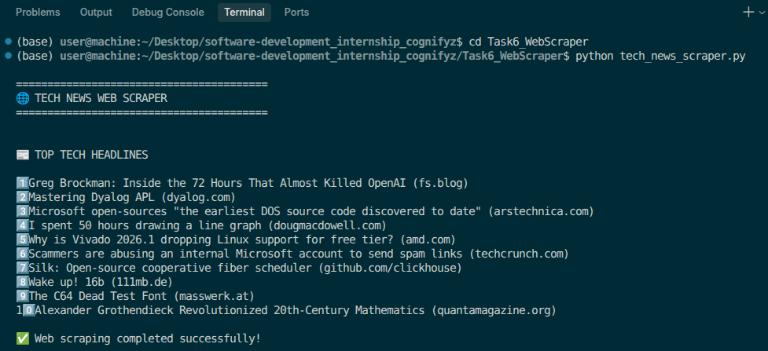
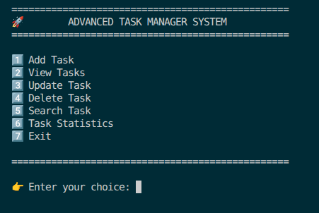
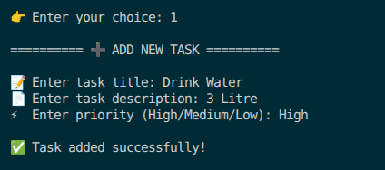
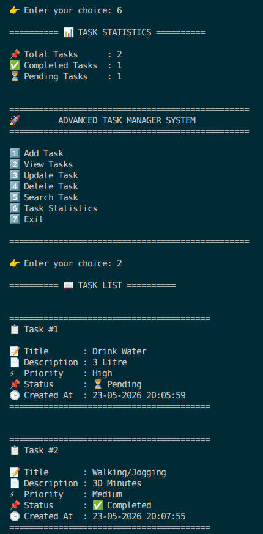
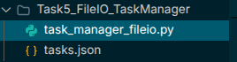
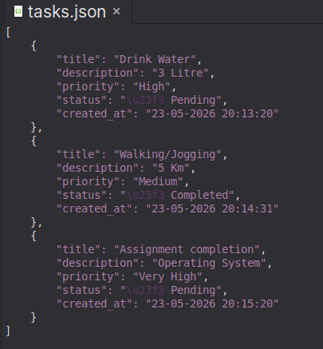
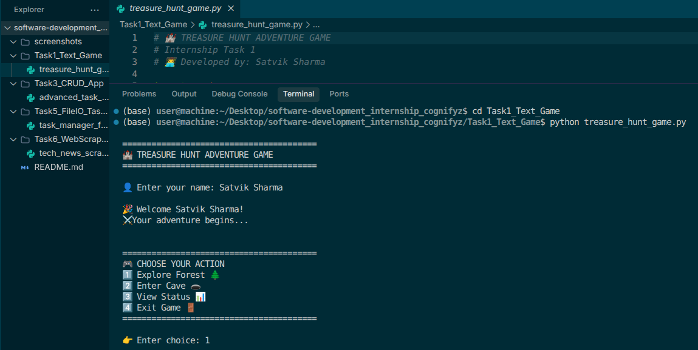
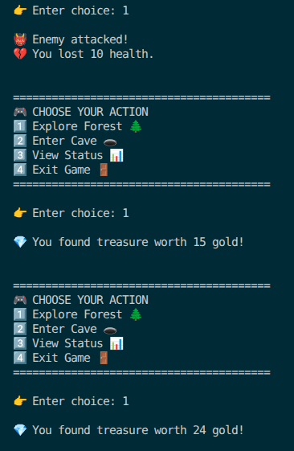
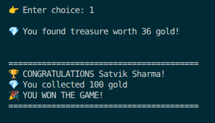

# 🚀 Software Development Projects I made in beginner level remote internships in 1st year


---

# 👨‍💻 Developed By

## Satvik Sharma
B.Tech CSE | 1st year Student | COER University

---

# 📌 Internship Tasks Completed

| Task No. | Project Name |
|----------|--------------|
| Task 6 | 🌐 Tech News Web Scraper |
| Task 3 | 📋 Advanced CRUD Task Manager |
| Task 5 | 💾 File I/O Task Manager |
| Task 1 | 🏰 Treasure Hunt Adventure Game |

---

# 🌐 Task 6 — Tech News Web Scraper

A Python-based web scraping project that fetches real-time tech headlines from websites using BeautifulSoup and Requests.

## ✨ Features

✅ Real-time Web Scraping  
✅ BeautifulSoup Integration  
✅ Requests Library  
✅ User-Friendly Output  
✅ Error Handling  

## 🛠️ Technologies Used

- Python
- BeautifulSoup
- Requests

---

## 📸 Screenshot

### 🌐 Scraper Output



---

# 📋 Task 3 — Advanced CRUD Task Manager

A console-based task management system implementing CRUD operations using Python and Object-Oriented Programming concepts.

## ✨ Features

✅ Add Tasks  
✅ View Tasks  
✅ Update Tasks  
✅ Delete Tasks  
✅ Search Tasks  
✅ Task Statistics  
✅ Priority Management  

## 🛠️ Technologies Used

- Python
- OOP Concepts
- Lists
- Functions

---

## 📸 Screenshots

### 🏠 Main Menu



### ➕ Add Task



### 📊 Task Statistics



---

# 💾 Task 5 — File I/O Task Manager

Enhanced version of the CRUD Task Manager with permanent task storage using JSON file handling.

## ✨ Features

✅ JSON File Storage  
✅ Persistent Task Saving  
✅ Automatic Task Loading  
✅ Error Handling  
✅ File Management  

## 🛠️ Technologies Used

- Python
- JSON
- File Handling

---

## 📸 Screenshots

### 💾 File Storage Output



### 📂 JSON File Data



---

# 🏰 Task 1 — Treasure Hunt Adventure Game

A fun interactive text-based adventure game developed using Python conditional statements and loops.

## ✨ Features

✅ Interactive Gameplay  
✅ Health System  
✅ Treasure Rewards  
✅ Enemy Attacks  
✅ Win/Lose Conditions  
✅ Random Events  

## 🛠️ Technologies Used

- Python
- Conditional Statements
- Loops
- Random Module

---

## 📸 Screenshots

### 🎮 Game Start



### ⚔️ Battle Scene



### 🏆 Winning Screen



---

# 📁 Project Structure

```text
software-development-cognifyz/
│
├── Task6_WebScraper/
│   └── tech_news_scraper.py
│
├── Task3_CRUD_App/
│   └── advanced_task_manager.py
│
├── Task5_FileIO_TaskManager/
│   ├── task_manager_fileio.py
│   └── tasks.json
│
├── Task1_Text_Game/
│   └── treasure_hunt_game.py
│
├── screenshots/
│   ├── scraper_output.png
│   ├── crud_menu.png
│   ├── add_task.png
│   ├── task_stats.png
│   ├── file_storage.png
│   ├── json_file.png
│   ├── game_start.png
│   ├── game_battle.png
│   └── game_win.png
│
└── README.md
```

---

# ▶️ How To Run

## 1️⃣ Clone Repository

```bash
git clone https://github.com/yourusername/software-development-cognifyz.git
```

## 2️⃣ Open Project Folder

```bash
cd software-development-cognifyz
```

## 3️⃣ Run Python Files

```bash
python filename.py
```

Example:

```bash
python tech_news_scraper.py
```

---

# 🎯 Learning Outcomes

Through this internship, I learned:

- Python Programming
- CRUD Operations
- Object-Oriented Programming
- File Handling
- JSON Storage
- Web Scraping
- Error Handling
- Project Structuring

---

This repository contains projects developed during the **Beginner level Software Development Internships Programs i made in my first year**.

---

# 📬 Contact

👨‍💻 Satvik Sharma  
🎓 B.Tech CSE | COER University  

🔗 LinkedIn: [Satvik Sharma](https://www.linkedin.com/in/satvik-sharma-577835372)

💻 GitHub: [Satvik2Sharma](https://github.com/Satvik2Sharma)

---
